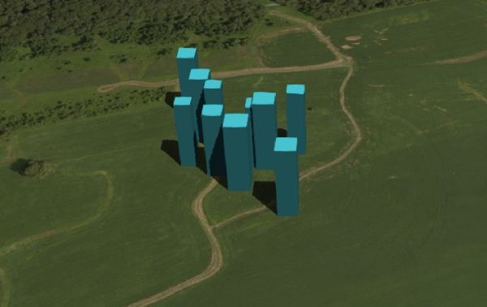
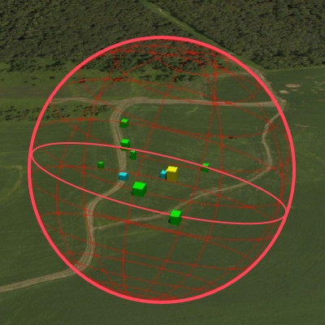
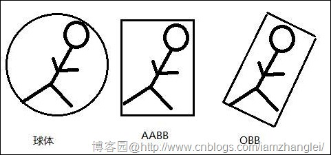
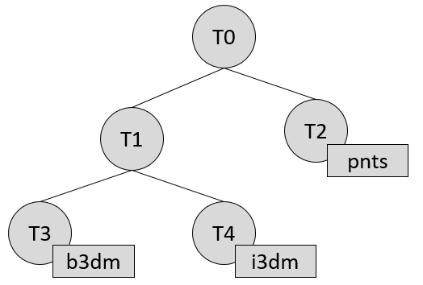
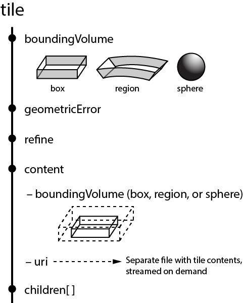

参考资料：

- https://github.com/CesiumGS/3d-tiles
- https://github.com/CesiumGS/3d-tiles/tree/master/specification
- https://github.com/CesiumGS/3d-tiles-samples
- https://blog.csdn.net/qq_31709249/article/details/102643371
- https://www.cnblogs.com/onsummer/p/12799366.html
- Khronos Group（科纳斯组织）

## 3D Tiles

### 引言(Introduction)

3D Tiles 是用于流式传输和渲染海量地理 3D 数据而设计的一种格式，如摄影测量、3D 建筑物、BIM/CAD、Instanced Features 实例要素和点云数据。它定义了一个分层的数据结构和提供渲染内容的瓦片格式集。3D Tiles 不对内容的可视化定义明确的规则，客户端可以采用合适的方式可视化 3D Tiles 数据。
在 3D Tiles 中，一个 瓦片集（tileset)是一个树形的用于组织空间数据结构的瓦片集合。一个瓦片集（tileset)至少有一个 tileset JSON 文件，该文件包含了 瓦片集（tileset)的元数据和树形瓦片对象，每个瓦片对象可引用下列格式之一的数据：

```
格式                                           用途

批量3D模型（b3dm）                             大型异构3D模型，包括三维建筑物、地形等

实例3D模型（i3dm）                             3D模型实例(一个模型多次渲染的数据)，如树、灯塔、椅子、风力发电机等

点云（pnts）                                   海量点云

组合数据（cmpt）                               以上不同格式的瓦片组合到一个瓦片中

```

一个瓦片（tile）的内容是 瓦片（tile）格式（如 b3dm、i3dm 等）的一个单独实例，它是一个二进制 blob，该 blob 是包含一个 Feature 表和一个 Batch 表的特定格式的组件。

瓦片（tile）的内容引用一个要素集（a set of features），例如表示建筑物或树的三维模型，或点云中的点。每个要素具有 Feature 表和 Batch 表，
Feature 表中存储位置和外观属性，Batch 表中存储其他具体应用的属性。客户端可以选择在运行时选择特性并检索其属性以进行可视化或者分析。

批量 3D 模型（Batched 3D Model，b3dm）和实例 3D 模型（Instanced 3D Model,i3dm）格式建立在 glTF 上，glTF 是一个为高效传输 3D 内容而设计的开放规范。这些格式的瓦片内容的二进制数据嵌入 gltf 集合，gltf 中包含包含模型几何体和纹理信息，点云格式数据不嵌入 glTF。

瓦片被组织在一棵树结构中，其中结合了层次细节（HLOD）的概念，以优化空间数据的渲染。每个瓦片都有一个边界体（ bounding volume），边界体是一个完全封闭其内容的空间范围。树结构具有空间一致性，子瓦片的内容完全位于父瓦片的边界体内。


瓦片集（tileset）可以使用 2 维空间切片策略，类似于栅格和矢量切片策略（如 wmts 或 xyz 切片策略），在服务中预定义几个细节层次（levels of detail）；但是，由于瓦片集（tileset）的内容通常是不一致的，或者可能不容易在二维中组织，因此树可以是具有空间一致性的任何空间数据结构，包括 k-d 树、四叉树、八叉树和网格。

瓦片集(tileset)可以使用一个 可选的 3 维瓦片样式（3D Tiles Style），瓦片样式定义了每个要素渲染的表达式。

### 文件扩展名和 MIME 类型(File extensions and MIME types)

- Tileset 文件使用.json 扩展名和 application/json MIME 类型;
- 瓦片内容文件使用文件类型和 MIME 格式指定其瓦片格式规范（如 i3dm,b3dm);
- Tileset 样式文件使用.json 扩展名和 application/json MIME 类型;
- 文件扩展名是可选的。有效的实现可以忽略它，并通过其头部中的魔法字段来标识内容的格式。

### JSON 编码

3D Tiles 在 JSON 格式化和编码上有以下限制：

- JSON 必须使用不带 BOM（Byte Order Mark，字节顺序标记）的 UTF-8 编码；
- 所有所有的字符（如属性名，枚举仅使用 ASCII 字符集，并且必须以纯文本形式写入；
- JSON 对象中的名称（键）必须是唯一的，即不允许重复的键。

### URI

- 3D Tiles 使用 uri 来引用瓦片内容。这些 uri 可以指向相对外部引用（RFC3986），也可以是在 JSON 中嵌入资源的数据 uri。嵌入式资源使用“data”URI 方案（RFC2397）。
- 当 URI 是相对的时，它总是相对于引用的 tileset JSON 文件。
- 客户端实现需要支持相关的外部引用和嵌入式资源。或者，客户端实现可以支持其他方案（如 http://）。所有 uri 必须有效且可解析。

### 单位

- 距离单位是米
- 所有的角度是弧度

### 坐标系 Coordinate reference system (CRS)

- 3D Tiles 使用右手笛卡尔坐标系，即 x 和 y 的叉积生成 z。3D Tiles 定义局部笛卡尔坐标系得到 z 轴朝上。3D Tiles 的全球坐标系通常位于 WGS 84 地球中心，地球固定（ECEF）参考坐标系（EPSG 4978），但这不是必须的，例如，发电厂可以在其局部坐标系中完全定义，以便在没有地理空间背景的情况下与建模工具一起使用。
- 可以使用瓦片坐标转换将瓦片总局部坐标系转换到其父瓦片的坐标系；
- 区域边界体（region bounding volume）使用地理坐标系统（经度，纬度，高度）指定边界，特别是 EPSG 4979。

### 概念

#### 瓦片（Tiles)

瓦片包含了一个瓦片是否渲染的元数据，可渲染内容的引用，以及子瓦片数组

#### 几何误差（几何误差）

瓦片被结构化成一个包含层次细节级别(HLOD)的树，因此在运行时，客户端实现将需要确定瓦片是否足够详细以用于呈现，以及瓦片的内容是否应该由更高分辨率的子瓦片连续细化。一个具体的应用将考虑最大允许屏幕空间误差(SSE)，以像素为单位的误差。

瓦片的几何误差定义了该瓦片的选择度量。它的值是一个非负数，指定瓦片的源几何图形简化表示的误差(以米为单位)。根瓦片作为源几何图形的最简化版本，将具有最大的几何误差。然后，每一个连续的子瓦片的几何误差将低于它的父层，子瓦片的几何误差等于或接近于 0。

在客户端实现中，如果瓦片被渲染，而它的子瓦片没有被渲染，几何误差与其他屏幕空间参数一起使用——例如瓦片到摄像机的距离、屏幕大小和分辨率——用于计算引入的屏幕空间误差(SSE)。如果引入的 SSE 超过了所允许的最大值，则对该 tile 进行细化，并考虑渲染它的子瓦片。

几何误差是基于诸如点密度、瓦片尺寸(以米为单位)或其他特定于瓦片集的因素而制定的。一般来说，更高的几何误差意味着瓦片将被更积极地细化，子瓦片将被更快地加载和渲染。

#### 细化(Refinement )

细化决定了在较低分辨率父瓦片被渲染，要选择较高分辨率的子瓦片时这一过程。
允许的细化类型是替换(“REPLACE”)和添加(“ADD”)。如果瓦片 进行了“REPLACE”细化，那么子瓦片将代替父瓦片进行呈现，也就是说父瓦片将不再呈现。如果瓦片有“ADD”细化，那么子瓦片会在父瓦片之外呈现。

瓦片集（tileset）可以只使用“REPLACE”细化，或只使用“ADD”细化，或者任何“REPLACE”细化和“ADD”细化的组合。

瓦片集（tileset）根瓦片必须有细化类型;所有其他的瓦片是可选的。当省略时，瓦片继承父瓦片的细化类型。

#### 替换(Replacement)

如果瓦片采用“REPLACE”细化，渲染时只渲染替换了的子瓦片。
  
 

#### 添加(Additive)

如果瓦片采用“Additive”细化, 渲染时同时渲染子瓦片和父瓦片。


#### 包围盒(Bounding volumes)

包围盒定义了包围瓦片或瓦片内容的空间范围。
要支持各种数据集（例如规则分割地形、与纬度或经度线不对齐的城市或任意点云）的紧密拟合体积，边界体类型包括定向包围盒、包围盒和由最小和最大纬度、经度和高度定义的地理区域。

Bounding box ：  


Bounding sphere：


Bounding region


- Bounding box: 是一个由 12 个数字组成的数组，它定义了一个在右手 3 轴(x, y, z)笛卡尔坐标系中 z 轴向上的有向包围盒。前三个元素定义了盒子中心的 x、y 和 z 值。接下来的三个元素(带索引 3、4 和 5)定义了 x 轴方向和半长度。接下来的三个元素(索引 6、7 和 8)定义了 y 轴方向和半长。最后三个元素(索引 9、10 和 11)定义 z 轴方向和半长。（即 OBB 包围盒）；

```
"boundingVolume": {
  "box": [
    0,   0,   10,
    100, 0,   0,
    0,   100, 0,
    0,   0,   10
  ]
}
```

- Bounding region: 是一个由六个数字组成的数组，这些数字定义了具有纬度、经度和高度坐标，其坐标顺序为[西，南，东，北，最小高度，最大高度]。 纬度和经度以 EPSG 4979 中定义的 WGS 84 基准为单位，以弧度为单位。高度以米为单位高于(或低于)WGS 84 椭球体。其每条边都和坐标轴平行（即 AABB 包围盒）。

```
"boundingVolume": {
  "region": [
    -1.3197004795898053,
    0.6988582109,
    -1.3196595204101946,
    0.6988897891,
    0,
    20
  ]
}
```

Bounding sphere:sphere 是一个由四个数字组成的数组，用于定义一个边界球体。前三个元素定义了球中心在右手 3 轴(x, y, z)笛卡尔坐标系中 z 轴向上的 x, y 和 z 值。最后一个元素(索引为 3)定义了半径,以米为单位。

```
"boundingVolume": {
  "sphere": [
    0,
    0,
    10,
    141.4214
  ]
}
```

3D Tiles 包围盒：


包围盒补充知识：
https://blog.csdn.net/qq_29579137/article/details/70502591  
https://www.cnblogs.com/lyggqm/p/5386174.html

包围盒:包围体算法是一种求解离散点集最优包围空间的方法。基本思想是用体积稍大且特性简单的几何体（称为包围体）来近似地代替复杂的几何对象。最常见的包围盒算法有:

- 轴对齐包围盒（AABB 包围盒,Axis-aligned bounding box）;
- 包围球（Sphere）;
- 有向包围盒（OBB 包围盒,Oriented bounding box）
- 固定方向凸包 FDH（Fixed directions hulls 或 k-DOP）

包围体类型：



#### Viewer request volume（观察者请求体）

瓦片 tile 的观察者请求体(viewerRequestVolume)可以用于组合异构数据集，也可以与外部 tileset 组合。

下面的示例在 b3dm 瓦片中有一个建筑物，在 pnts 瓦片中有一个建筑内部的点云。点云瓦片的包围体(boundingVolume)是半径为 1.25 的球体。该点云瓦片还有一个半径为 15 的观察者请求体（viewerRequestVolume）球体。由于 geometricError 为零，因此当视野位于观察者请求体(viewerRequestVolume)球体内时，将始终呈现（并最初请求）点云平瓦片的内容。


```json
{
  "children": [
    {
      "transform": [
        4.843178171884396,
        1.2424271388626869,
        0,
        0,
        -0.7993325488216595,
        3.1159251367235608,
        3.8278032889280675,
        0,
        0.9511533376784163,
        -3.7077466670407433,
        3.2168186118075526,
        0,
        1215001.7612985559,
        -4736269.697480114,
        4081650.708604793,
        1
      ],
      "boundingVolume": {
        "box": [0, 0, 6.701, 3.738, 0, 0, 0, 3.72, 0, 0, 0, 13.402]
      },
      "geometricError": 32,
      "content": {
        "uri": "building.b3dm"
      }
    },
    {
      "transform": [
        0.968635634376879,
        0.24848542777253732,
        0,
        0,
        -0.15986650990768783,
        0.6231850279035362,
        0.7655606573007809,
        0,
        0.19023066741520941,
        -0.7415493329385225,
        0.6433637229384295,
        0,
        1215002.0371330238,
        -4736270.772726648,
        4081651.6414821907,
        1
      ],
      "viewerRequestVolume": {
        "sphere": [0, 0, 0, 15]
      },
      "boundingVolume": {
        "sphere": [0, 0, 0, 1.25]
      },
      "geometricError": 0,
      "content": {
        "uri": "points.pnts"
      }
    }
  ]
}
```

#### 变换 Transforms

##### 瓦片变换 Tile transforms

为了支持局部坐标系——例如，城市建筑群中的某一个建筑物自己的局部坐标系，一个在建筑物中的点云集定义自己的坐标系- 给每个 Tile 都提供了一个可选的 transform 属性。

transform 属性是一个以列主序存储的 4×4 矩阵，通过此属性，Tile 的坐标就可以是自己的局部坐标系内的坐标，最后通过自己的 transform 矩阵变换到父节点的坐标系中。transform 会对以下属性的数据进行变换：

- tile.content：（这个字段实际是 Tile 数据的具体存放位置字段，下面有介绍）tranform 矩阵会应用到 content 中的

  - 每个 feature 的位置坐标
  - 每个 feature 的法向量（实际上只有在进行缩放旋转变换时，法向量才需要变换，故只需要应用 4×4 逆转置矩阵左上角的 3×3 矩阵对法向量进行变化即可，具体过程可以看看图形学的介绍）
  - content.boundingVolume, 除非定义了 content.boundingVolume.region，因为它是显示地在 EPSG:4979 坐标系中定义的

- tile.boudingVolume：包围体，除非定义了 tile.boundingVolume.region，因为它是显示地在 EPSG:4979 坐标系中定义的

- tile.viewerRequestVolume：，除非定义了 tile.viewerRequestVolume.region，因为它是显示地在 EPSG:4979 坐标系中定义的

几何误差（geometricError）不需要进行应用 transform 变换，因为变化矩阵不会影响几何误差——几何误差都是以米为单位定义的。

当 transform 未定义时，其默认是一个如下所示的单位阵。

```
[
1.0, 0.0, 0.0, 0.0,
0.0, 1.0, 0.0, 0.0,
0.0, 0.0, 1.0, 0.0,
0.0, 0.0, 0.0, 1.0
]
```

对 tile 的变化是从上自下的多个变换的一个级联变换的过程，这个很容易理解，因为 LOD 是一个树的结构，所以叶子节点的变换就是从根节点到下的一个矩阵级联变换的过程。

##### glTF transforms

b3dm 和 i3dm 都是通过内嵌 glTF 模型来实现的，而 glTF 模型本身就有矩阵变换 ，glTF 定义了自己的节点层级和自己的 y 轴向上的坐标系，故 Tile 的 transform 是应用在 glTF 的变化之后的。

- glTF node hierarchy
  首先，gltf 节点层级转换根据 gltf 规范进行（https://github.com/KhronosGroup/glTF/tree/master/specification/2.0#transformations）。

- y 轴向上到 z 轴向上
  为了与 3D tiles 的 z 轴向上坐标系一致，必须将 gltf 从 y 轴向上转换为 z 轴向上，这是通过将模型绕 x 轴旋转 π/2 实现的。相当于应用如下转换矩阵（矩阵是列主序的）：

```
[
1.0, 0.0,  0.0, 0.0,
0.0, 0.0, -1.0, 0.0,
0.0, 1.0,  0.0, 0.0,
0.0, 0.0,  0.0, 1.0
]

```

更加通用的转换顺序为：

- 1. gltf 节点层级转换
- 2. gltf y 轴向上到 z 轴向上转换
- 3. 任意瓦片格式具体的转换：

  - b3dm 的要素表（Feature Table）可能定义 RTC_CENTER 用于转换模型顶点
  - i3dm 的要素表定义每个实例的位置、法线和缩放，它们用于创建应用于每个实例的 4\*4 仿射变换矩阵

- 4. 瓦片转换：
     当作用于 z 轴向上的源数据时，如 WGS84 或局部 Z 轴向上的坐标系，通用的工作流程为：
  - 网格数据，包括位置和法线不修改，它们仍然是 z 轴向上
  - 根节点矩阵指定了一个列主序从 z 轴向上到 y 轴向上的转换，这将源数据转换为 glTF 所需的 y-up 坐标系
  - 在运行时，glTF 使用上面的矩阵从 y-up 转换回 z-up。实际上，这些变换相互抵消。

##### 示例 Example

以下图的节点层级为例：



各个节点的变换应该为:

```
TO: [T0]
T1: [T0][T1]
T2: [T0][T2]
T3: [T0][T1][T3]
T4: [T0][T1][T4]

```

在瓦片的转换之前，瓦片内容中的位置、法线也可能有 特定的转换，比如：

- b3dm 和 i3dm 瓦片中嵌入 gltf，gltf 定义了自己的节点层级和坐标系统，tile.transform 在解析这些变换后使用，参见 gltf 变换（https://github.com/CesiumGS/3d-tiles/tree/master/specification#gltf-transforms）
- i3dm 的要素表定义每个实例的位置、法线和缩放，它们用于创建应用于每个实例的 4\*4 仿射变换矩阵
- 压缩属性如 i3dm 和点云 要素表（Feature Table）中的 POSITION_QUANTIZED 和点云中的 NORMAL_OCT16P 在任何其他变换前应该解压缩

因此，上例完整的 变换矩阵是：

```
TO: [T0]
T1: [T0][T1]
T2: [T0][T2][pnts-specific transform, including RTC_CENTER (if defined)]
T3: [T0][T1][T3][b3dm-specific transform, including RTC_CENTER (if defined), coordinate system transform, and glTF node hierarchy]
T4: [T0][T1][T4][i3dm-specific transform, including per-instance transform, coordinate system transform, and glTF node hierarchy]
```

下面的 js 代码是使用 Cesium 的 Matrix4 和 Matrix3 计算变换矩阵：

```

function computeTransforms(tileset) {
    var t = tileset.root;
    var transformToRoot = defined(t.transform) ? Matrix4.fromArray(t.transform) : Matrix4.IDENTITY;

    computeTransform(t, transformToRoot);
}

function computeTransform(tile, transformToRoot) {
    // Apply 4x4 transformToRoot to this tile's positions and bounding volumes

    var inverseTransform = Matrix4.inverse(transformToRoot, new Matrix4());
    var normalTransform = Matrix4.getRotation(inverseTransform, new Matrix3());
    normalTransform = Matrix3.transpose(normalTransform, normalTransform);
    // Apply 3x3 normalTransform to this tile's normals

    var children = tile.children;
    var length = children.length;
    for (var i = 0; i < length; ++i) {
        var child = children[i];
        var childToRoot = defined(child.transform) ? Matrix4.fromArray(child.transform) : Matrix4.clone(Matrix4.IDENTITY);
        childToRoot = Matrix4.multiplyTransformation(transformToRoot, childToRoot, childToRoot);
        computeTransform(child, childToRoot);
    }
}
```

### 瓦片 JSON Tile JSON

瓦片的属性如下：



下面是一个没有 叶子瓦片的例子：

```json
{
  "boundingVolume": {
    "region": [
      -1.2419052957251926,
      0.7395016240301894,
      -1.2415404171917719,
      0.7396563300150859,
      0,
      20.4
    ]
  },
  "geometricError": 43.88464075650763,
  "refine" : "ADD",
  "content": {
    "boundingVolume": {
      "region": [
        -1.2418882438584018,
        0.7395016240301894,
        -1.2415422846940714,
        0.7396461198389616,
        0,
        19.4
      ]
    },
    "uri": "2/0/0.b3dm"
  },
  "children": [...]
}
```

- boundingVolume ： 定义了包围瓦片 tile 的体对象，用于确定在运行时渲染哪些 tile。上面的示例使用了 region 体，也可以使用 box 体和 sphere 体；

- geometricError ： 非负数，用于定义 瓦片渲染以及其子瓦片不渲染时的误差，以米 为单位。运行时 geometricError 用于计算 屏幕空间误差（Screen-Space Error (SSE) ），屏幕误差以像素为单位。SSE 决定当前视图下瓦片是否足够详细，或者是否要考虑渲染其子瓦片

- viewerRequestVolume：可选，使用与 boundingVolume 相同的结构，视野只有在 viewerRequestVolume 内部，瓦片内容才会请求；
- refine：取值为"REPLACE" 或者 "ADD"，该属性对瓦片集（tileset）的 根瓦片（root tile）是必须的，对于其他的瓦片是可选的。一个瓦片集可使用任意的 "REPLACE" 或者 "ADD" 组合的细化策略。如果忽略该属性，瓦片的细化策略继承其父瓦片的策略；
- content： 该属性是一个包含了瓦片渲染内容元数据的对象。content 的 uri 是指向 tile 的二进制内容的 uri（请参阅 tile 格式规范），或者是另一个 tileset JSON （请参阅外部 tileset）。
  content 的 uri 中的文件扩展名不是必须的，因为 content 中的瓦片格式可以被头部的魔术字段 识别，或者是一个外部的瓦片集
  下面的截图中 红色包围体 显示了 Canary Wharf 根瓦片（root tile）的 包围体 boundingVolume ，包围了整个瓦片集。content.boundingVolume 以蓝色显示，包围了根瓦片中的 4 个要素（模型）


- transform：可选属性，是一个 4\*4 仿射变换矩阵，用于变换瓦片的 content、boundingVolume, 和 viewerRequestVolume
- children：定义子瓦片的数组，每个子瓦片的内容完全包含在父瓦片的包围体 boundingVolume 中，通常其几何误差 geometricError 小于父瓦片的几何误差。对于叶子瓦片，子瓦片的数组长度为 0，并且 children 可以不定义

详细的属性参考可参见 https://github.com/CesiumGS/3d-tiles/tree/master/specification#property-reference

### 瓦片集 TileSet

tileSet 有四个属性：asset、properties、geometricError、root。下面来逐个介绍每个属性：

- 1.asset
  asset 包含整个 tileSet 的元数据，asset.Version 属性，定义了 3DTiles 的版本，此版本号指定 tileSet 的 JSON 模式和基本的 tileSet 格式。tileVersion 属性可选，用于定义特定的应用程序的 tileset。

- 2.properties
  包含 tileSet 中的每个要素属性的对象。上面的例子是一个建筑物的 3DTiles，因此每个瓦片都含有三维建筑物模型，每个三维建筑物模型都有 Height 属性，所以上面的例子中就定义了 Height 属性。 每个属性的作用通常如属性名称相对应（如例子中的 Height 对应高度），并且包含该属性的最大值和最小值。这对于创建随值变换的色带的模型很有用（根据某个属性设置模型颜色渐变）。

- 3.geometricError
  geometricError 是一个非负数，是通过这个几何误差的值来计算屏幕误差 SSE，确定 tileSet 是否渲染。如果在渲染的过程中，当前屏幕误差大于这里定义的屏幕误差，这个 tileSet 就不渲染。

- 4.root
  root 是一个定义了根瓦片的对象，root 的几何误差和瓦片集顶层的几何误差不同，tileSet 的 geometricError 是根据屏幕误差来控制 tileSet 中的 root 是否渲染。而 tile 中的 geometricError 则是用来控制 tile 中的 children 是否渲染。

 
