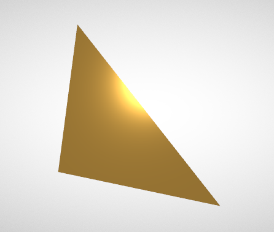

## 一个简单的材质 A Simple Material

之前章节，我们给出了一个包含有简单场景的 glTF 资源，但它没有包含对场景中 3D 对象外观描述的材质信息。当没有材质信息时，会假定使用一个默认的材质设置，如之前我们给出的那个最小巧的 glTF 格式文件的渲染结果，3D 对象会使用被以白色或浅灰色进行渲染。

本章节我们从一个带有材质信息的最简单的 glTF 格式文件开始，解释材质信息对渲染效果的影响。

下面就是这个带有材质信息的 glTF 格式文件的内容：

```
{
  "scenes" : [
    {
      "nodes" : [ 0 ]
    }
  ],

  "nodes" : [
    {
      "mesh" : 0
    }
  ],

  "meshes" : [
    {
      "primitives" : [ {
        "attributes" : {
          "POSITION" : 1
        },
        "indices" : 0,
        "material" : 0
      } ]
    }
  ],

  "buffers" : [
    {
      "uri" : "data:application/octet-stream;base64,为了排版而省略，可以使用英文原文中的代码",
      "byteLength" : 44
    }
  ],
  "bufferViews" : [
    {
      "buffer" : 0,
      "byteOffset" : 0,
      "byteLength" : 6,
      "target" : 34963
    },
    {
      "buffer" : 0,
      "byteOffset" : 8,
      "byteLength" : 36,
      "target" : 34962
    }
  ],
  "accessors" : [
    {
      "bufferView" : 0,
      "byteOffset" : 0,
      "componentType" : 5123,
      "count" : 3,
      "type" : "SCALAR",
      "max" : [ 2 ],
      "min" : [ 0 ]
    },
    {
      "bufferView" : 1,
      "byteOffset" : 0,
      "componentType" : 5126,
      "count" : 3,
      "type" : "VEC3",
      "max" : [ 1.0, 1.0, 0.0 ],
      "min" : [ 0.0, 0.0, 0.0 ]
    }
  ],

  "materials" : [
    {
      "pbrMetallicRoughness": {
        "baseColorFactor": [ 1.000, 0.766, 0.336, 1.0 ],
        "metallicFactor": 0.5,
        "roughnessFactor": 0.1
      }
    }
  ],
  "asset" : {
    "version" : "2.0"
  }
}
```

使用了材质信息后，三角形的渲染效果如下：



### 材质定义 Material definition

可以看出，我们添加了一个 materials 数组对象到 glTF 的 JSON 文件中。它包含了一个 material 对象，用于定义材质信息：

```
 "materials" : [
    // material对象
    {
      "pbrMetallicRoughness": {
        "baseColorFactor": [ 1.000, 0.766, 0.336, 1.0 ],
        "metallicFactor": 0.5,
        "roughnessFactor": 0.1
      }
    }
  ],

```

这里的 material 对象只包含了一个 pbrMetallicRoughness 对象，这一对象指定了基于 metallic-roughness 模型的材质属性(没有显式指定的材质属性会使用属性的默认值)。

- baseColorFactor 属性包含了红，绿，蓝和 alpha 成分，构成了材质了基本颜色(这里设置的是亮橘色)。
- metallicFactor 属性用于指定材质的反射情况与金属的相似度，这里我们设置相似度为 0.5。
- roughnessFactor 属性用于指定材质粗糙度，这里我们设置粗糙度为 0.1。

### 使用材质信息 Assigning the material to objects

通过 mesh 对象的 primitive 属性，通过索引就可以引用使用材质信息：

```
  "meshes" : [
    {
      "primitives" : [ {
        "attributes" : {
          "POSITION" : 1
        },
        "indices" : 0,
        "material" : 0 // 引用 索引为0的 材质
      } ]
    }
```

下一章节，我们会介绍如何使用纹理，使用纹理可以定义更加复杂的材质信息，让 3D 对象看起来更加真实。
