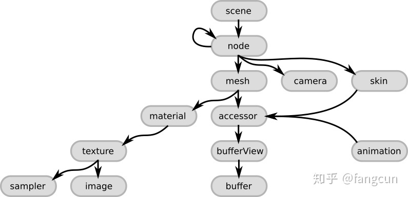
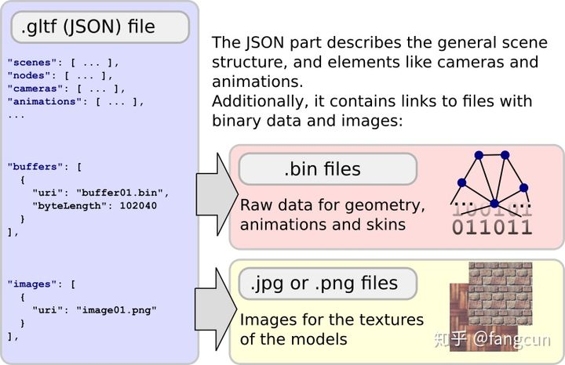

## 2 glTF格式基本结构 
- glTF格式本质上是一个JSON文件。这一文件描述了整个3D场景的内容。它包含了对场景结构进行描述的场景图。
- 场景中的3D对象 通过场景结点引用网格进行定义。
- 材质 定义了3D对象的外观，
- 动画 定义了3D对象的变换操作(比如选择、平移操作)。
- 蒙皮 定义了3D对象如何进行骨骼变换，
- 相机 定义了渲染程序的视锥体设置。

### 2.1 JSON结构
场景对象以数组的形式存储在JSON文件中。可以通过对应的数组来索引访问：

```
"meshes" : 
[
    { ... }
    { ... }
    ...
],
```

数组索引也被用来定义对象之间的关系。上面的代码定义了多个网格对象，场景中的一个结点可以通过网格索引引用上面定义的其中一个网格对象：

```
"nodes": 
[
    { "mesh": 0, ... },
    { "mesh": 5, ... },
    ...
}
```

下图给出了glTF格式的JSON部分的顶级元素概览：



这里我们对这些元素进行简要说明，读者如果想要更加深入地了解它们，可以通过链接获取glTF规范对它们地详细说明。

- scene：glTF格式的场景结构描述条目。它通过引用node来定义场景图。
- node：场景图中的一个结点。它可以包含一个变换(比如旋转或平移)，引用更多的子结点。它可以引用网格和相机，以及描述网格变换的蒙皮。
- camera：定义了用于渲染场景的视锥体配置。
- mesh：描述了场景中出现的3D对象的网格数据。它引用的accessor对象可以用来访问真实的几何数据。它引用的material对象定义了3D对象的外观。
- skin：定义了用于蒙皮的参数，参数的值通过一个accessor对象获得。
- animation：描述了一些结点如何随时间进行变换(比如旋转或平移)。
- accessor：一个访问任意数据的抽象数据源。被mesh、skin和animation元素使用来提供几何数据，蒙皮参数和基于时间的动画值。它通过引用一个- bufferView对象，来引用实际的二进制数据。
- material：包含了定义3D对象外观的参数。它通常引用了用于3D对象渲染的texture对象。
- texture：定义了一个sampler对象和一个image对象。sampler对象定义了image对象在3D对象上的张贴方式。


### 2.2 引用外部数据

二进制数据，比如3D对象的几何数据和纹理数据通常不被包含在JSON文件中，它们被存储在外部的文件中。JSON文件中只包含了到这些外部文件的链接。这使得二进制数据可以以非常紧凑的形式进行存储方便互联网传输，并且可以直接被渲染程序使用，无需额外的解码、预处理。



如上图所示，有两种类型的对象buffers和images可以包含外部文件链接。我们会在之后的章节对它们进行详细说明。
 
### 2.3 读取和管理外部数据
读取和处理glTF格式文件从分析JSON结构开始，JSON结构被分析完后，就可以使用buffers和images数组来索引访问buffer和image对象。每个buffer和image对象引用了一块二进制数据。通常会将二进制数据读取到内存中，以它们在原来buffers和images数组中的索引顺序进行存储，以便使用相同的索引来访问对象对应的二进制数据。

### 2.4 buffers中的二进制数据
一个buffer包含了一个指向二进制数据的URI：

```
"buffer01": {
    "byteLength": 12352,
    "type": "arraybuffer",
    "uri": "buffer01.bin"
}
```
二进制数据本质上是一个从buffer对象的URI处读取得到的内存块，没有任何层次和结构意义。在之后的章节，我们将会介绍通过数据类型和数据布局来描述二进制数据的意义。二进制数据使用起来比JSON格式更加高效，便于在互联网传输使用，渲染程序无需解码、预处理就可以直接使用。

### 2.5 images中的图像数据
一个image对象可以引用一个外部图像文件来作为要渲染的3D对象的纹理：

```
"image01": {
    "uri": "image01.png"
}

```
uri通常指向一个PNG或JPG文件。这些格式的图像文件可以显著减小图像数据的体积，便于互联网传播。image对象也可以引用存储在buffer中的图像数据，我们会在之后的章节的进行说明。


##  2.6 数据URI中的二进制数据
通常，buffer和image对象的uri指向了一个包含实际数据的文件，但也可以直接在uri中通过数据URI(data:[<mediatype>][;base64],<data>)直接包含数据。
- URI:  https://developer.mozilla.org/en-US/docs/Web/HTTP/Basics_of_HTTP/Data_URIs
