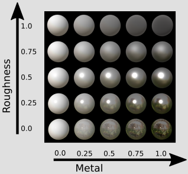

## 材质 Materials

## 概述 Introduction

glTF 格式的目的是作为 3D 资源的中转格式。它不仅包含了场景结构和场景中对象的几何数据信息，还包含了场景中对象的外观信息。

有多种不同的可以表示材质的方式，*着色模型(shading model)*描述了如何处理这些属性, 简单的有 Phong 模型(https://en.wikipedia.org/wiki/Phong_reflection_model) 或 Blinn-Phong 模型(https://en.wikipedia.org/wiki/Blinn%E2%80%93Phong_shading_model)可以直接被常见的图形API如
OpenGL、WebGL 所支持 。

这些着色模型通过一组基本的材质属性来定义 3D 对象的外观表现。比如，材质属性包含了漫反射光颜色（color of diffusely reflected light ）信息（通常以纹理的形式），镜面反射光颜色（the color of specularly reflected light,）信息和光强信息（shininess parameter）。许多 3D 资源文件正好包含这些参数，比如，Wavefront OBJ 文件结合 'MTL' 文件包含了 3D 对象的纹理和颜色信息，渲染器可以直接读取这些信息用于渲染 3D 对象。但是为了描述更真实的材质，需要更复杂的着色和材质模型。

### 基于物理渲染(Physically-Based Rendering PBR)

为了能够表示出更加真实的 3D 对象，需要材质信息能够描述 3D 对象表面的物理属性。有多种表示 3D 对象表面物理属性的方式，目前最常见的是 metallic-roughness 模型，它主要使用下面这 3 个参数描述 3D 对象表面的物理属性：

为了允许渲染器在不同的照明条件下显示更加真实的 3D 对象，着色模型必须考虑对象曲面的*物理*属性。这些物理材料属性有不同的表示形式。目前最常见的是 metallic-roughness 模型（metallic-roughness-model）。它主要使用下面这 3 个参数描述 3D 对象表面的物理属性：

- base color：3D 对象表面的主要颜色。
- metallic：用于描述 3D 对象表面的反射表现与金属表面的反射表现的相似度。
- roughness：用于描述 3D 对象表面 影响散射光的粗糙度 。

glTF 数据格式直接支持 metallic-roughness 模型，对于其它材质表示方式，比如 specular-glossiness 模型，可以通过扩展来支持。

metallic 和 roughness 的值对于渲染效果的影响如下图所示：

base color、metallic 和 roughness 属性的值可以直接给定，作用到**整个**3D 对象上，也可以通过纹理给定，从而为 3D 对象的不同部分提供不同的属性，使渲染效果看起来更加真实。

基于着色模型，可以对 3D 对象表面应用其他效果。通常，这些附加效果的设置通过纹理和缩放系数给定：

- emissive 纹理：用于描述 3D 对象表面发出特定光的部分。
- occlusion 纹理：用于模拟 3D 对象遮挡产生阴影的效果。
- normal 纹理：用于调整表面法线，使其能够模拟更精细的几何细节，而不需要更高的网格分辨率。

glTF 支持所有这些附加属性，并为省略这些属性的情况定义合理的默认值。
