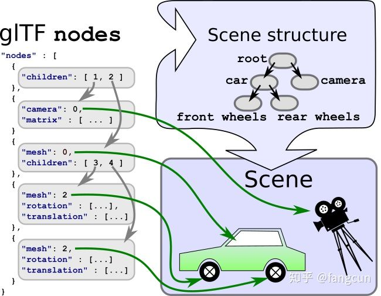

## 4 场景和结点(Scenes and Nodes)

一个 glTF 文件可以包含了多个场景，但通常来说，只包含了一个场景。每个场景包含了一个 nodes 数组，这一数组引用了场景的场景图的所有根结点。同样，场景图可以有多个根结点，但通常只有一个根结点。下面代码描述了只包含一个根结点的场景：

```
"scenes" : [
    {
      "nodes" : [ 0 ]
    }
  ],

  "nodes" : [
    {
      "mesh" : 0
    }
  ],
```

### 4.1 结点构成场景图

每个 node 对象包含一个 children 数组，这一数组引用了 node 对象的所有子结点。通过孩子结点，构成了整个场景结构。



通过递归遍历 scene 中的结点，就可以完成整个场景的处理，伪代码如下：

```
traverse(node) {
    // Process the meshes, cameras, etc., that are
    // attached to this node - discussed later
    processElements(node);

    // Recursively process all children
    for each (child in node.children) {
        traverse(child);
    }
}
```

实践中，遍历过程还会需要一些和结点关联的附加信息。比如对结点的累加变换进行处理，就需要额外的附加信息。

### 4.2 局部和全局变换

每个 node 对象附加有变换操作(平移、旋转或缩放)。附加的变换操作会被应用到 node 对象本身以及它的所有孩子结点。这使得我们可以对一组结点通过结点层次执行同样得变换操作。

#### 4.2.1 结点的局部变换

对于 node 对象可以附加不同的局部变换表示。可以将变换直接以 node 对象的 matrix 属性给出。matrix 属性是一个包含 16 个浮点数的数组，按照列主序排列矩阵元素。下面代码描述了一个缩放(2,1,0.5)，绕 x 轴旋转 30 度，平移(10,20,30)的 matrix 属性：

```
"node0": {
    "matrix": [
        2.0,    0.0,    0.0,    0.0,
        0.0,    0.866,  0.5,    0.0,
        0.0,   -0.25,   0.433,  0.0,
       10.0,   20.0,   30.0,    1.0
    ]
}

```

上面代码定义了下图的矩阵：


也可以使用 translation，rotation 和 scale 属性来表示变换：

```
"node0": {
    "translation": [ 10.0, 20.0, 30.0 ],
    "rotation": [ 0.259, 0.0, 0.0, 0.966 ],
    "scale": [ 2.0, 1.0, 0.5 ]
}
```

每个变换属性可以被用来构造变换矩阵，作为 node 对象的局部变换，将所有变换属性构成的变换矩阵连乘后就得到了 node 对象的局部变换矩阵：

- translation 属性包含了 x，y 和 z 轴方向的平移。比如(10.0，20.0，30.0)这一平移，可以构造出下面这一矩阵：   


- rotation 属性以四元数的形式给出。四元数的数学意义超出了本教程的范围，读者可以自行了解。四元数可以方便地表示绕任意轴旋转任意角度。比如四元数(0.259，0.0，0.0，0.966)表示绕 x 轴旋转 30 度。四元数可以转换为旋转变换矩阵，如下图所示：


- scale 属性包含了 x，y 和 z 轴的缩放系数。可以使用这些缩放系数来构造缩放变换矩阵。如下图是使用(2.0，1.0，0.5)作为缩放系数构造的缩放变换矩阵：       
  

我们将 translation、rotation 和 scale 属性构造的变换矩阵连乘起来就得到了 node 对象的局部变换矩阵。连乘的顺序非常重要，**局部变换矩阵 M=T*R*S** 。  
其中 T 是 translation 属性构造的变换矩阵，R 是 rotation 属性构造的变换矩阵，S 是 scale 属性构造的变换矩阵。计算局部变换矩阵的伪代码如下所示：         

```
translationMatrix = createTranslationMatrix(node.translation);
rotationMatrix = createRotationMatrix(node.rotation);
scaleMatrix = createScaleMatrix(node.scale);
localTransform = translationMatrix * rotationMatrix * scaleMatrix;
```

对于上面我们构造的 T，R，S 变换矩阵连乘后得到的局部变换矩阵 M 如下图所示：                


node 对象的局部变换矩阵会对**附着在其上的 mesh 进行缩放，旋转和平移变换**。

如果 translation、rotation 和 scale 属性中的某个属性**没有给出**，则使用**单位矩阵**作为其构造的变换矩阵。  
当一个 node 对象既不包含 matrix 属性又不包含任何 TRS 变换属性，那么就会使用**单位矩阵**作为它的局部变换矩阵。

#### 4.2.2 结点的全局变换

不管在 JSON 文件中如何表示，node 对象的局部变换都能够被作为一个 4x4 矩阵进行存储。一个 node 对象的全部变换由从根结点到这一 node 对象结点路径上的所有局部变换矩阵连乘得到：

Structure: local transform global transform
root R R
+- nodeA A R*A
+- nodeB B R*A*B
+- nodeC C R*A\*C
需要注意，由于进行动画时可能会修改一部分 node 对象的局部变换，我们不能简单地只进行一次全局变换计算。在之后的章节，我们会介绍动画如何修改部分 node 对象的局部变换。部分 node 对象的局部变换改变会对它的所有孩子结点的全局变换产生影响。我们可以通过对全局变换进行缓冲，通过检测父亲结点的局部变换是否发生变化，来决定是否更新全局变换的缓冲值，来提高一定的性能表现。
