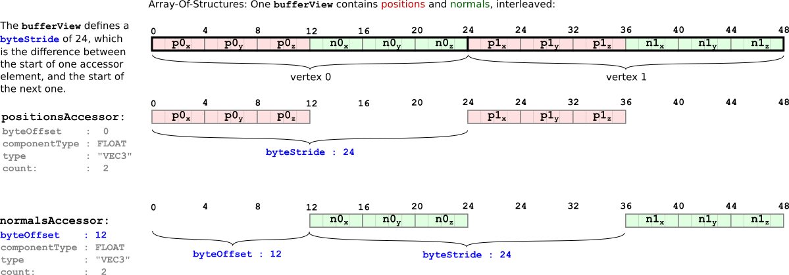
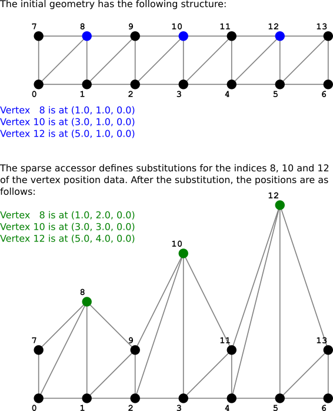

## 5 缓冲，缓冲视图和访问器(Buffers, BufferViews, and Accessors)

我们在之前的章节给出了一个包含 buffer，bufferView 和 accessor 对象的简单 glTF 格式文件。本章节我们对其中出现的这几个对象进行更为详细地说明。

### 5.1 缓冲 Buffers

一个 buffer 对象表示了一个没有任何层次结构和意义的二进制数据块。缓冲的数据通过 uri 属性引用。uri 属性可以引用一个外部文件作为缓冲的数据，也可以直接使用数据 URI 作为缓冲的数据。之前章节，我们使用了大小为 44 字节的经过编码的数据 URI 作为缓冲的数据。

```

  "buffers" : [
    // buffer对象
    {
      "uri" : "data:application/octet-stream;base64,AAABAAIAAAAAAAAAAAAAAAAAAAAAAIA/AAAAAAAAAAAAAAAAAACAPwAAAAA=",
      "byteLength" : 44
    }
  ],

```


buffer 对象的数据可以被作为渲染使用的**顶点属性、顶点索引、关键帧和蒙皮**信息。为了使用 buffer 对象中的数据，需要额外的信息来描述 buffer 对象中数据的结构和数据的类型。

### 5.2 缓冲视图 BufferViews

buffer 对象中的数据可以通过 bufferView 对象结构化。一个 bufferView 对象代表了一个 buffer 对象的部分数据。这一部分数据的范围通过一个偏移值和长度定义。下面的代码定义了两个 bufferView 对象：

```
 "bufferViews" : [
   //第一个bufferView对象
    {
      "buffer" : 0, // 引用了索引为0的buffer对象
      "byteOffset" : 0, // 偏移值0
      "byteLength" : 6, // 6个字节
      "target" : 34963  // ELEMENT_ARRAY_BUFFER
    },
    //第二个bufferView对象
    {
      "buffer" : 0,  // 引用了索引为0的buffer对象
      "byteOffset" : 8,  // 偏移值8
      "byteLength" : 36, // 36个字节
      "target" : 34962  // ARRAY_BUFFER
    }
  ],

```

- 第一个 bufferView 对象引用了**索引为 0**的 buffer 对象的**前 6 个字节**的数据。
- 第二个 bufferView 对象引用了从**偏移值 8**开始的**36 个字节**的 buffer 对象的数据。'
- 每个 bufferView 对象包含了一个 target 属性。这一属性可以被渲染程序用来对 bufferView 引用的数据进行分类。target 属性的值可以是一个**表示数据使用方式的常量**(34962 表示 ARRAY_BUFFER)，(34963 表示 ELEMENT_ARRAY_BUFFER)。  
  buffer 对象的数据被分成多个部分，每一部分使用了一个 bufferView 对象进行描述。为了在渲染程序中使用这些数据还需要知道数据的类型和布局。

如下图所示：


上图中的浅色部分数据用来对齐数据，便于访问器使用.

### 5.3 访问器 Accessors

一个 accessor 对象引用了一个 bufferView 对象，定义了 bufferView 所引用数据的类型和布局。

#### 5.3.1 数据类型 Data type

accessor 对象的 type 属性和 componentType 属性定义了引用的 bufferView 的数据类型。

- type 属性的值是一个指定了数据类型的字符串。比如"SCALAR"表示标量值，"VEC3"表示 3D 向量，"MAT4"表示 4x4 矩阵。

- componentType 属性定义了数据分量的基础类型，比如 5126 代表 FLOAT，5123 代表 UNSIGNED_SHORT。

通过组合使用这两个属性值，可以描述任意的数据类型。下面的代码，包含了两个 accessor 对象用于描述数据类型：

```
"accessors" : [
  //第一个accessor对象，顶点索引数据
    {
      "bufferView" : 0,  // 引用索引为0的bufferView对象
      "byteOffset" : 0,  // 偏移量
      "componentType" : 5123, // UNSIGNED_SHORT
      "count" : 3,      // 数据元素的数量
      "type" : "SCALAR",  // 标量
      "max" : [ 2 ],
      "min" : [ 0 ]
    },
    //第二个accessor对象，顶点属性数据
    {
      "bufferView" : 1,    // 引用索引为1的bufferView对象
      "byteOffset" : 0,    // 偏移量
      "componentType" : 5126, // FLOAT
      "count" : 3,  //  // 数据元素的数量
      "type" : "VEC3",   // 3D向量数据
      "max" : [ 1.0, 1.0, 0.0 ],
      "min" : [ 0.0, 0.0, 0.0 ]
    }
  ],
```

第一个 accessor 对象引用了索引为 0 的 bufferView 对象，这一 bufferView 对象描述了 buffer 数据中的顶点索引数据，type 属性为"SCALAR"，componentType 属性为 5123(UNSIGNED_SHORT)。这两个属性表示顶点索引数据是 unsigned short 类型的标量。

第二个 accessor 对象引用了索引为 1 的 bufferView 对象，这一 bufferView 对象描述了 buffer 数据中的顶点属性数据。描述的数据的 type 为"VEC3"，componentType 为 5126(FLOAT)。这一 accessor 对象描述了分量类型为 float 的 3D 向量数据。

#### 5.3.2 数据布局 Data layout

accessor 对象所附加的属性指定了数据的布局。count 属性指定了数据元素的数量。对于上面代码中的 2 个 accessor 对象，它们的 count 属性值都是 3，对应三角形的 3 个顶点的索引值。每个 accessor 对象还有一个 byteOffset 属性，对于上面的代码，因为每个 accessor 对象只对应使用了一个 bufferView 对象，2 个 accessor 对象的 byteOffset 属性值都是 0。但对于多个 accessor 对象引用同一个 bufferView 对象的情况，byteOffset 属性值指定了 accessor 所访问数据的开始位置。

#### 5.3.3 数据对齐 Data alignment

accessor 对象所引用的数据可能会被直接交给图形硬件进行渲染，也可能被作为 CPU 端使用的动画或蒙皮数据。accessor 对象引用的数据由于它的用途，需要根据数据的类型进行对齐。当 accessor 对象的 componentType 属性值为 5126(FLOAT)时，**一个 float 类型值占 4 个字节**，所以数据应该按 4 字节对齐。accessor 对象的需要它引用的 bufferView 对象和 buffer 对象满足对齐需求：

- accessor 对象的 byteOffset 属性值需要能够整除 componentType 属性所指定的类型所占的字节大小。
- accessor 对象的 byteOffset 属性值和 bufferView 对象的 byteOffset 属性值之和需要能够整除 componentType 属性所指定的类型所占的字节大小。

上面代码引用的索引为 1 的 bufferView 对象(引用了顶点属性数据)的 byteOffset 属性值为 8。设置这个值是为了满足 accessor 对象的 4 字节对齐的要求，buffer 对象数据的 6、7 字节为了满足对齐而没有被使用。

图 5c 图示了 buffer 对象的数据是如何通过 bufferView 对象进行结构化，以及数据是如何满足 accessor 对象的对齐要求。


#### 5.3.4 数据交错 Data interleaving

bufferView 对象所引用的数据可能以结构数组的形式进行存储，通过 byteStride 属性确定下一个引用数据的位置。byteStride 属性用于指定两个数据元素之间的字节距离。下图图示了顶点位置和法线数据交错存储在一起时，accessor 对象通过不同的 byteStride 属性引用 bufferView 的所需的顶点位置属性和顶点法线属性。



#### 5.3.4 数据内容 Data contents
accessor对象包含了min和max两个属性用于提供数据的大小信息。对于顶点位置数据，min和max属性定义了3D对象的包围盒，我们可以使用它来决定优先加载哪些数据，或者进行可见性检测。这些信息对于运行时进行数据量化分析也很有用。
 

###  5.4 稀疏访问器 Sparse accessors

glTF的2.0版本引入了稀疏访问器的概念。稀疏访问器允许数据以非常紧凑的方式进行存储。比如，多个3D对象可以通过稀疏访问器，共享同一份几何数据。如果多个3D对象只有少部分的顶点位置数据不同，通过稀疏访问器，只需要存储3D对象的顶点位置数据一次，然后存储对象间不同的顶点位置数据即可。

下面代码是一个稀疏访问器的使用例子：

```javascript
{
  "scenes" : [ {
    "nodes" : [ 0 ]
  } ],
  
  "nodes" : [ {
    "mesh" : 0
  } ],
  
  "meshes" : [ {
    "primitives" : [ {
      "attributes" : {
        "POSITION" : 1
      },
      "indices" : 0
    } ]
  } ],
  
  "buffers" : [ {
    "uri" : "",
    "byteLength" : 284
  } ],
  
  "bufferViews" : [ {
    "buffer" : 0,
    "byteOffset" : 0,
    "byteLength" : 72,
    "target" : 34963
  }, {
    "buffer" : 0,
    "byteOffset" : 72,
    "byteLength" : 168
  }, {
    "buffer" : 0,
    "byteOffset" : 240,
    "byteLength" : 6
  }, {
    "buffer" : 0,
    "byteOffset" : 248,
    "byteLength" : 36
  } ],
  
  "accessors" : [ {
    "bufferView" : 0,
    "byteOffset" : 0,
    "componentType" : 5123,
    "count" : 36,
    "type" : "SCALAR",
    "max" : [ 13 ],
    "min" : [ 0 ]
  }, {
    "bufferView" : 1,
    "byteOffset" : 0,
    "componentType" : 5126,
    "count" : 14,
    "type" : "VEC3",
    "max" : [ 6.0, 4.0, 0.0 ],
    "min" : [ 0.0, 0.0, 0.0 ],
    "sparse" : {
      "count" : 3,
      "indices" : {
        "bufferView" : 2,
        "byteOffset" : 0,
        "componentType" : 5123
      },
      "values" : {
        "bufferView" : 3,
        "byteOffset" : 0
      }
    }
  } ],
  
  "asset" : {
    "version" : "2.0"
  }
}
```

上面代码由渲染程序渲染后可以得到下图：


代码中包含了两个访问器：一个用于网格的**顶点索引数据**，一个用于**顶点位置数据**。其中一个引用顶点数据的accessor对象定义了一个附加的sparse对象，包含了需要替换的数据信息。

```
"accessors" : [ 
  ...
  {
    "bufferView" : 1,
    "byteOffset" : 0,
    "componentType" : 5126,
    "count" : 14,
    "type" : "VEC3",
    "max" : [ 6.0, 4.0, 0.0 ],
    "min" : [ 0.0, 0.0, 0.0 ],
    "sparse" : {
      "count" : 3,  // 替换数据元素的个数
      "indices" : {
        "bufferView" : 2, // 引用了索引为2的bufferView对象,用于替换的顶点索引数据[8，10，12]
        "byteOffset" : 0,
        "componentType" : 5123
      },
      "values" : { // 包含实际的数据
        "bufferView" : 3, //引用了索引为3的bufferView对象,包含用于替换的实际值
        "byteOffset" : 0
      }
    }
  } ],

```
sparse对象定义了替换数据元素的个数。sparse.indices属性引用了一个bufferView对象，包含了用于替换的顶点索引数据。sparse.values引用了一个bufferView对象，用于包含实际的数据。

上面代码，索引为1的bufferView对象存储了原始的几何数据。它描述了顶点数据构成了一个矩形，sparse.indices引用了索引为2的bufferView对象，包含了要替换的顶点数据索引信息[8，10，12]。sparse.values引用了索引为3的bufferView对象，包含了用于替换的顶点数据[(1，2，0)，(3，3，0)，(5，4，0)]。下图图示了顶点数据的替换过程：




